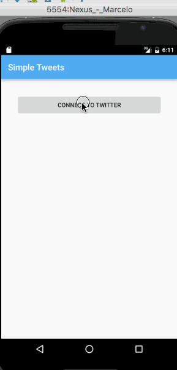

# My Simple Tweets (Twitter API)

> What's Grid Image Search?

My Simple Tweets is an android app that allows a user to view home and mentions timelines, view user profiles with user timelines, as well as compose and post a new tweet.

> What can you do?

* Sign in to Twitter using OAuth login.
* View tweets from user home timeline.
* User can compose and post a new tweet.

> What are the additional features?

* The user is able to:
    - View more tweets as they scroll with [Infinite pagination](http://guides.codepath.com/android/Endless-Scrolling-with-AdapterViews). There are [Twitter Api Rate Limits](https://dev.twitter.com/rest/public/rate-limiting) in place
    - Pull down to refresh tweets timeline.
    - View The username, name, and body for each tweet.
    - [Relative timestamp](https://gist.github.com/nesquena/f786232f5ef72f6e10a7) for each tweet "8m", "7h".
    - Taken back to home timeline with new tweet visible in timeline
    - Switch between Timeline and Mention views using tabs
    - Navigate to view their own profile, besides see picture, tagline, # of followers, # of following, and tweets on their profile.
    - Click on the profile image in any tweet to see another user's profile and see picture, tagline, # of followers, # of following, and tweets of clicked user.
    - Tap a tweet to open a detailed tweet view.
    - See a counter with total number of characters left for tweet** on compose tweet page.
    - View following / followers list through the profile.
    - Take favorite (and unfavorite) or retweet actions on a tweet.
* Implements robust error handling, [check if internet is available](http://guides.codepath.com/android/Sending-and-Managing-Network-Requests#checking-for-network-connectivity), handle error cases, network failures
* Persistence: User can open the twitter app offline and see last loaded tweets. Persisted in SQLite tweets are refreshed on every application launch. While "live data" is displayed when app can get it from Twitter API, it is also saved for use in offline mode.

## Walkthrough

GIF created with [LiceCap](http://www.cockos.com/licecap/).

## License
* [Apache Version 2.0](http://www.apache.org/licenses/LICENSE-2.0.html)

## Acknowledgements
* [Android Async HTTP](https://github.com/loopj/android-async-http) - Simple asynchronous HTTP requests with JSON parsing
* [Picasso](http://square.github.io/picasso/) - Image loading and caching library for Android
* [Twitter REST API](https://dev.twitter.com/rest/public).
* [Active Android](http://www.activeandroid.com/) -  Persistence. 